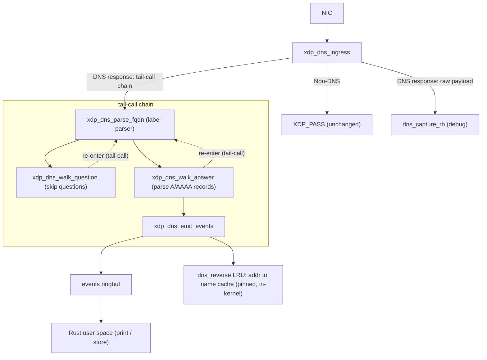
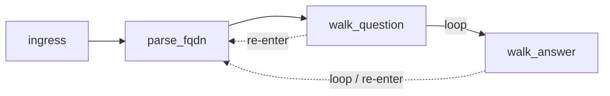

# ebpf-dns-cache

An in-kernel DNS response parser built with eBPF XDP and Rust. It captures DNS A/AAAA records from live network traffic at the network driver level, before packets reach the kernel networking stack.

## Concept

Every DNS response carries a mapping from a domain name to one or more IP addresses. Normally, user-space resolvers (glibc, systemd-resolved) handle this — but they are invisible to programs that want to observe or cache these mappings at the OS level.

This project attaches an XDP program to a network interface and parses every incoming DNS response in the kernel, emitting structured events (domain → IP) to user space via a ring buffer. The goal is zero-copy, low-overhead DNS observation that works independently of the resolver in use.

## Architecture



### Why XDP?

XDP (eXpress Data Path) runs eBPF programs at the earliest point in the receive path — inside the network driver, before `sk_buff` allocation. This means:

- **No copy**: the program reads directly from the DMA buffer.
- **No context switch**: everything happens in the kernel.
- **No interference**: the program passes every packet up unchanged (`XDP_PASS`); it only observes.

### Why tail-calls?

The eBPF verifier limits a single program to a bounded number of instructions. Parsing a DNS response requires walking a variable number of questions and answers, each with a variable-length name — too complex for one program. Tail-calls solve this: each logical stage is a separate eBPF program that jumps into the next via a `BPF_MAP_TYPE_PROG_ARRAY` table, sharing state through a per-CPU map. The chain is:



`parse_fqdn` can be re-entered from either walker, allowing names in both the question section (for context) and the answer section to be parsed with the same code.

### Per-CPU state

All mutable parser state lives in a `BPF_MAP_TYPE_PERCPU_ARRAY` with one slot. Because XDP processes each packet on the CPU that receives it, no locking is needed — each CPU has its own copy of the state structure.

```c
struct dns_parser_state {
    u16  id;              // DNS transaction ID
    u32  dns_base;        // byte offset of DNS header in packet
    u32  packet_offset;   // current read position
    u16  q_remaining;     // questions left to skip
    u16  a_remaining;     // answers left to parse
    u16  answer_idx;      // index of current answer record
    u8   return_prog;     // which program parse_fqdn should tail-call back to
    char name_buf[512];   // assembled domain name
    cache_entry_t cache[256];     // suffix cache (offset → name window)
    pending_label_t pending[256]; // labels recorded during current name walk
    frame_t stack[16];            // call stack for pointer chains
};
```

### Reverse cache (address → name)

Emitting events to user space is enough for observation, but enforcement needs to answer the inverse question at packet time: *given a destination IP, what name was it resolved from?* To support that, the final tail-call stage (`xdp_dns_emit_events`) also writes each A/AAAA record into an in-kernel **reverse cache** — an `BPF_MAP_TYPE_LRU_HASH` keyed by address, holding the owner name:

```c
typedef struct dns_ip_key {          // key — fully zeroed before use (LRU hashes every byte)
    u8  is_ipv6;                     // 0 = A (v4), 1 = AAAA (v6)
    u8  _pad[3];
    u8  addr[16];                    // network order; v4 in addr[0..4], v6 in addr[0..16]
} dns_ip_key_t;

typedef struct dns_rev_value {
    u64  inserted_ns;                // bpf_ktime_get_ns() at last write
    u32  ttl;                        // record TTL (seconds)
    u16  name_len;
    u16  _pad;
    char name[256];                  // owner FQDN, zero-padded
} dns_rev_value_t;
```

Design notes:

- **LRU**, not a plain hash: the map is bounded at `DNS_CACHE_REV_ENTRIES` (16384) entries, and the kernel evicts the least-recently-used entry when it fills, so memory is capped without any user-space reaping.
- **TTL stamping**: each entry records `inserted_ns` and the record's `ttl`. The LRU never expires entries on its own, so any reader compares `bpf_ktime_get_ns()` against `inserted_ns + ttl` and treats an aged-out entry as a miss.
- **Pinned by name** (`LIBBPF_PIN_BY_NAME`): the map lives at `/sys/fs/bpf/dns_reverse`, so a separate process can reopen the exact same map without attaching its own XDP program — this is what `--dump-cache` (below) relies on.
- The value struct (272 B) is too large for the XDP stack, so it is staged in a per-CPU scratch map (`rev_scratch`) and copied into `dns_reverse` by `bpf_map_update_elem`.

## DNS Name Parsing

DNS names are encoded as a sequence of length-prefixed labels followed by a zero byte:

```
03 77 77 77              →  "www"
07 65 78 61 6d 70 6c 65  →  "example"
03 63 6f 6d              →  "com"
00                       →  (end)
```

RFC 1035 also defines **compression pointers**: a two-byte sequence with the top two bits set (`0xC0`) encodes a 14-bit offset into the DNS message where a previously-seen name suffix begins. Real responses use this heavily — a response with four answers to `api.example.com` will encode the name once and point to it three more times.

### Suffix cache

Naively following every pointer by re-parsing from the target offset would be O(n²) in the number of pointer indirections. Instead, the parser builds a suffix cache as it walks each name:

- After parsing `www.example.com`, the cache holds three entries:
  - offset 12 → `"www.example.com"` (15 chars at name_buf[0])
  - offset 16 → `"example.com"` (11 chars at name_buf[4])
  - offset 24 → `"com"` (3 chars at name_buf[12])
- When a subsequent name contains a pointer to offset 16, the parser looks up the cache, finds `"example.com"`, and copies it directly — no re-parsing.

This makes pointer resolution O(1) after the first parse.

### Verifier workarounds

The eBPF verifier tracks the range of every scalar value and rejects programs that perform arithmetic it cannot prove is bounded. The DNS parser is inherently variable-length, which creates friction. Two patterns appear throughout the C code:

```c
// Hide a value's provenance so the verifier treats it as an unknown scalar,
// forcing subsequent masks to be the sole proof of boundedness.
#define BARRIER(var) asm volatile("" : "+r"(var))

// After BARRIER, mask to prove the value fits in a buffer index.
cursor = (cursor + label_len) & (DNS_NAME_BUF - 1);
```

Loop bodies are unrolled with `#pragma clang loop unroll(full)` where the iteration count is known at compile time.


## Build

Requirements: `clang`, `llvm`, `bpftool`, Rust 1.70+, kernel 5.8+.

```bash
# Generate vmlinux.h from the running kernel's BTF
make vmlinux

# Compile the BPF C code and generate the Rust skeleton
make skel

# Build the Rust loader (debug)
make build

# Build optimized
make release

# Run unit tests (requires CAP_BPF / sudo)
make test

# Run a single test by name
make test-one TEST=parses_multi_label_fqdn
```

## Usage

```bash
sudo ./target/debug/ebpf-dns-cache [-v] [--dump-cache] <interface>
# e.g.
sudo ./target/debug/ebpf-dns-cache eth0
```

- `-v` enables verbose BPF debug logging.
- `--dump-cache` prints the current reverse cache and exits (see below). An interface is not required in this mode.

Example output:

```
INFO [loader] attached xdp_dns_ingress to eth0 (ifindex=2). Ctrl-C to detach.
INFO [loader] [txid=9174 answer=0] api.example.com A 93.184.216.34
INFO [loader] [txid=9174 answer=1] api.example.com A 93.184.216.35
INFO [loader] [txid=2976 answer=0] connectivity-check.ubuntu.com AAAA 2620:2d:4000:1::17
```

Structured logs go to `dns-cache_YYYY-MM-DD_HH-MM-SS.log`. Raw DNS payloads (for debugging or test generation) are written to `payloads.json`.

### Dumping the reverse cache

While an instance is attached and observing traffic, it populates the pinned `dns_reverse` map (see [Reverse cache](#reverse-cache-address--name)). A second invocation with `--dump-cache` reopens that same pinned map, prints every live (non-expired) `address → name` entry, and exits without attaching:

```bash
sudo ./target/debug/ebpf-dns-cache --dump-cache
```

```
INFO [loader] reverse DNS cache (address -> name):
INFO [loader]   93.184.216.34 -> api.example.com (ttl=300s, age=12s)
INFO [loader]   2620:2d:4000:1::17 -> connectivity-check.ubuntu.com (ttl=60s, age=4s)
INFO [loader] 2 live entries
```

Entries whose age exceeds their TTL are skipped (treated as a miss), so the dump reflects only currently-valid mappings.

## Kernel requirements

| Feature | Minimum kernel |
|---------|---------------|
| XDP | 4.8 |
| `BPF_MAP_TYPE_PERCPU_ARRAY` | 4.6 |
| `BPF_MAP_TYPE_PROG_ARRAY` (tail-calls) | 4.2 |
| `BPF_MAP_TYPE_LRU_HASH` (reverse cache) | 4.10 |
| `BPF_MAP_TYPE_RINGBUF` | 5.8 |
| BTF (for `vmlinux.h`) | 5.2 |

Linux 5.8 or later is recommended.
