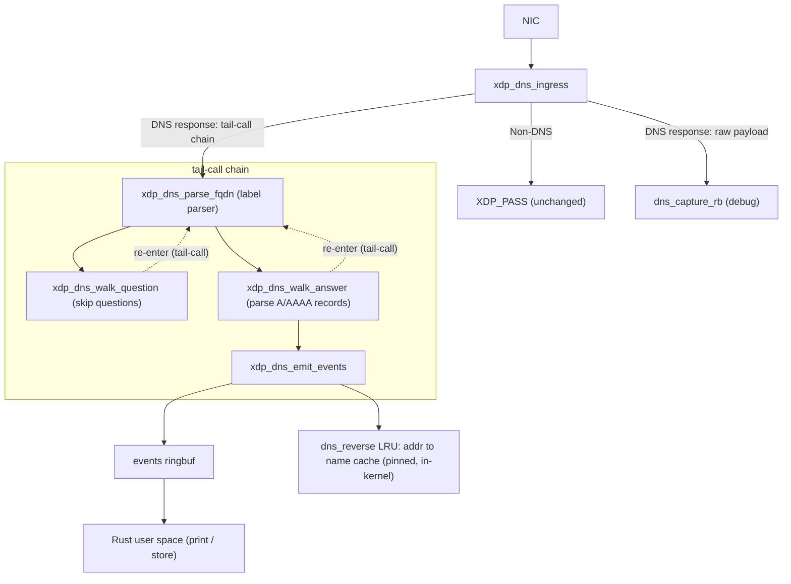
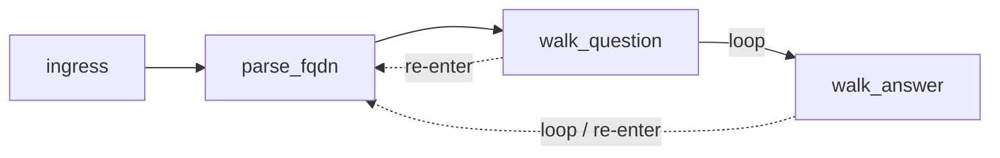
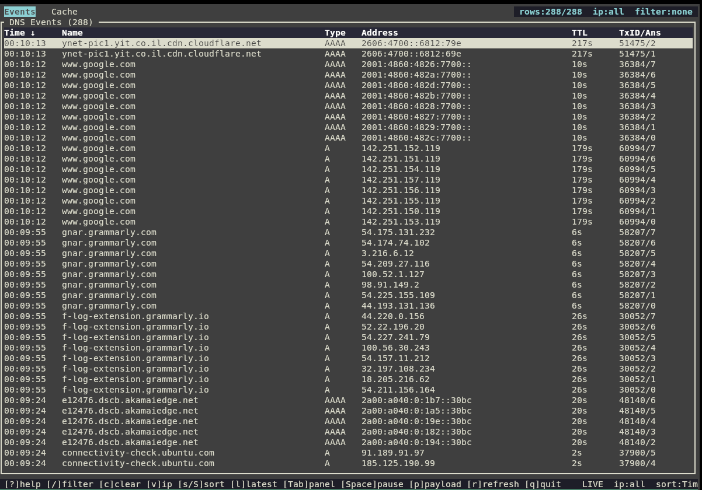
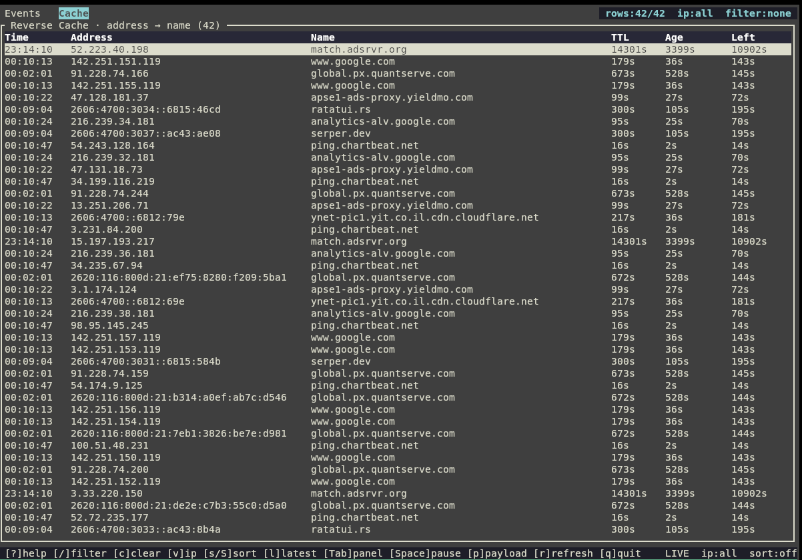

# ebpf-dns-cache

An in-kernel DNS response parser built with eBPF XDP and Rust. It captures DNS A/AAAA records from live network traffic at the network driver level, before packets reach the kernel networking stack.

## Architecture



### Why XDP?

XDP (eXpress Data Path) runs eBPF programs at the earliest point in the receive path — inside the network driver, before `sk_buff` allocation. This means:

- **No copy**: the program reads directly from the DMA buffer.
- **No context switch**: everything happens in the kernel.
- **No interference**: the program passes every packet up unchanged (`XDP_PASS`); it only observes.

### Why tail-calls?

The eBPF verifier limits a single program to a bounded number of instructions. Parsing a DNS response requires walking a variable number of questions and answers, each with a variable-length name — too complex for one program. Tail-calls solve this: each logical stage is a separate eBPF program that jumps into the next via a `BPF_MAP_TYPE_PROG_ARRAY` table, sharing state through a per-CPU map. The chain is:



`parse_fqdn` can be re-entered from either walker, allowing names in both the question section (for context) and the answer section to be parsed with the same code.

### Per-CPU state

All mutable parser state lives in a `BPF_MAP_TYPE_PERCPU_ARRAY` with one slot. Because XDP processes each packet on the CPU that receives it, no locking is needed — each CPU has its own copy of the state structure.


### Reverse cache (address → name)

Emitting events to user space is enough for observation, but enforcement needs to answer the inverse question at packet time: *given a destination IP, what name was it resolved from?* To support that, the final tail-call stage (`xdp_dns_emit_events`) also writes each A/AAAA record into an in-kernel **reverse cache** — an `BPF_MAP_TYPE_LRU_HASH` keyed by address, holding the owner name:


Design notes:

- **LRU**, not a plain hash: the map is bounded at `DNS_CACHE_REV_ENTRIES` (16384) entries, and the kernel evicts the least-recently-used entry when it fills, so memory is capped without any user-space reaping.
- **TTL stamping**: each entry records `inserted_ns` and the record's `ttl`. The LRU never expires entries on its own, so any reader compares `bpf_ktime_get_ns()` against `inserted_ns + ttl` and treats an aged-out entry as a miss.
- **Pinned by name** (`LIBBPF_PIN_BY_NAME`): the map lives at `/sys/fs/bpf/dns_reverse`, so a separate process can reopen the exact same map without attaching its own XDP program — this is what `--dump-cache` (below) relies on.
- The value struct (272 B) is too large for the XDP stack, so it is staged in a per-CPU scratch map (`rev_scratch`) and copied into `dns_reverse` by `bpf_map_update_elem`.

## DNS Name Parsing

DNS names are encoded as a sequence of length-prefixed labels followed by a zero byte:

```
03 77 77 77              →  "www"
07 65 78 61 6d 70 6c 65  →  "example"
03 63 6f 6d              →  "com"
00                       →  (end)
```

RFC 1035 also defines **compression pointers**: a two-byte sequence with the top two bits set (`0xC0`) encodes a 14-bit offset into the DNS message where a previously-seen name suffix begins. Real responses use this heavily — a response with four answers to `api.example.com` will encode the name once and point to it three more times.

### Suffix cache

Naively following every pointer by re-parsing from the target offset would be O(n²) in the number of pointer indirections. Instead, the parser builds a suffix cache as it walks each name:

- After parsing `www.example.com`, the cache holds three entries:
  - offset 12 → `"www.example.com"` (15 chars at name_buf[0])
  - offset 16 → `"example.com"` (11 chars at name_buf[4])
  - offset 24 → `"com"` (3 chars at name_buf[12])
- When a subsequent name contains a pointer to offset 16, the parser looks up the cache, finds `"example.com"`, and copies it directly — no re-parsing.

This makes pointer resolution O(1) after the first parse.

## Build

Requirements: `clang`, `llvm`, `bpftool`, Rust 1.70+, kernel 5.8+.

```bash
# Generate vmlinux.h from the running kernel's BTF
make vmlinux

# Compile the BPF C code and generate the Rust skeleton
make skel

# Build the Rust binary (debug)
make build

# Build optimized
make release

# Run unit tests (requires CAP_BPF / sudo)
make test

# Run a single test by name
make test-one TEST=parses_multi_label_fqdn
```

## Usage

```bash
sudo ./target/debug/ebpf-dns-cache [-v] [--payload] [--dump-cache | --tui] <interface>
# e.g.
sudo ./target/debug/ebpf-dns-cache eth0
```

- `-v` enables verbose BPF debug logging.
- `--payload` writes captured raw DNS payloads to `payloads.json` (for debugging or test generation). Off by default; in `--tui` mode it sets the initial state of the `p` toggle.
- `--dump-cache` prints the current reverse cache and exits (see below). An interface is not required in this mode.
- `--tui` runs an interactive terminal UI (see [Interactive TUI](#interactive-tui)). Requires an interface; mutually exclusive with `--dump-cache`.

Example output:

```
INFO [ebpf_dns_cache] attached xdp_dns_ingress to eth0 (ifindex=2). Ctrl-C to detach.
INFO [ebpf_dns_cache] [txid=9174 answer=0] api.example.com A 93.184.216.34
INFO [ebpf_dns_cache] [txid=9174 answer=1] api.example.com A 93.184.216.35
INFO [ebpf_dns_cache] [txid=2976 answer=0] connectivity-check.ubuntu.com AAAA 2620:2d:4000:1::17
```

Structured logs go to `dns-cache_YYYY-MM-DD_HH-MM-SS.log`. Raw DNS payloads (for debugging or test generation) are written to `payloads.json` only when `--payload` is passed.

### Dumping the reverse cache

While an instance is attached and observing traffic, it populates the pinned `dns_reverse` map (see [Reverse cache](#reverse-cache-address--name)). A second invocation with `--dump-cache` reopens that same pinned map, prints every live (non-expired) `address → name` entry, and exits without attaching:

```bash
sudo ./target/debug/ebpf-dns-cache --dump-cache
```

```
INFO [ebpf_dns_cache] reverse DNS cache (address -> name):
INFO [ebpf_dns_cache]   93.184.216.34 -> api.example.com (ttl=300s, age=12s)
INFO [ebpf_dns_cache]   2620:2d:4000:1::17 -> connectivity-check.ubuntu.com (ttl=60s, age=4s)
INFO [ebpf_dns_cache] 2 live entries
```

Entries whose age exceeds their TTL are skipped (treated as a miss), so the dump reflects only currently-valid mappings.

### Interactive TUI

`--tui` attaches like a normal run but, instead of streaming log lines, presents a [ratatui](https://ratatui.rs)-based terminal UI with two tabbed panels:

```bash
sudo ./target/release/ebpf-dns-cache --tui eth0
```

- **Events** — a live feed of parsed DNS answers (local arrival time `HH:MM:SS`, name, record type, address, TTL, transaction id / answer index) as they arrive on the `events` ring buffer. By default the feed is sorted newest-first (most recent at the top) and follows new arrivals; press `l` at any time to jump back to this latest-first view.

  

- **Cache** — the in-kernel `dns_reverse` map (`Time` — local insertion time `HH:MM:SS`, derived from age at snapshot — `address → name`, TTL, age, and `Left` — the time-to-live remaining, computed as `TTL − age`), re-read every ~5 seconds (or on demand with `r`), with expired entries filtered out.

  

A background worker thread owns the skeleton and ring buffers and snapshots the cache; the main thread renders and handles input. In TUI mode logging is file-only (`dns-cache_*.log`) so it can't corrupt the screen. Payload capture to `payloads.json` is toggled live with `p` (initialised from the `--payload` flag).

Both panels support **filtering** and **sorting**. The filter is a case-insensitive substring matched against both the name and the address; sorting cycles through the panel's columns (the sorted column is marked with `↑`/`↓` in its header). The Events feed starts sorted by `Time` descending (newest at the top) and follows new arrivals there; choosing any other sort column or direction suspends following until you press `l` to return to the default latest-first view.

Keybindings:

| Key | Action |
|-----|--------|
| `Tab` | switch panel (Events ⇄ Cache) |
| `/` | filter: type a query (applied live), `Enter` keeps it, `Esc` clears it |
| `c` | clear the active filter |
| `v` | cycle IP family filter (all → v4 → v6) |
| `s` | cycle the active panel's sort column (off → first → … → off) |
| `S` | toggle sort direction (ascending / descending) |
| `l` | reset the Events feed to the default latest-first view (`Time ↓`) and resume following |
| `↑` / `↓`, `PgUp` / `PgDn` | scroll the active panel (PgUp/PgDn by 10 rows) |
| `g` / `G` | jump to top / bottom (top is the newest event; `g` resumes following) |
| `Space` | pause/resume the feed (also auto-paused when you scroll) |
| `p` | toggle writing captured payloads to `payloads.json` |
| `r` | force an immediate cache refresh |
| `?` / `h` | toggle the help overlay |
| `q` / `Esc` / `Ctrl-C` | quit (detaches XDP and restores the terminal) |

The footer shows live/paused state, the active sort, whether payload capture is on/off, the active filter, current cache size, the count of feed events dropped under load, and any worker error.

## Kernel requirements

| Feature | Minimum kernel |
|---------|---------------|
| XDP | 4.8 |
| `BPF_MAP_TYPE_PERCPU_ARRAY` | 4.6 |
| `BPF_MAP_TYPE_PROG_ARRAY` (tail-calls) | 4.2 |
| `BPF_MAP_TYPE_LRU_HASH` (reverse cache) | 4.10 |
| `BPF_MAP_TYPE_RINGBUF` | 5.8 |
| BTF (for `vmlinux.h`) | 5.2 |

Linux 5.8 or later is recommended.

